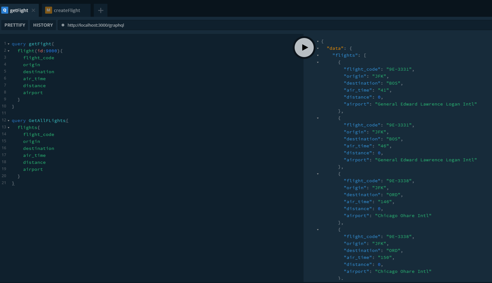
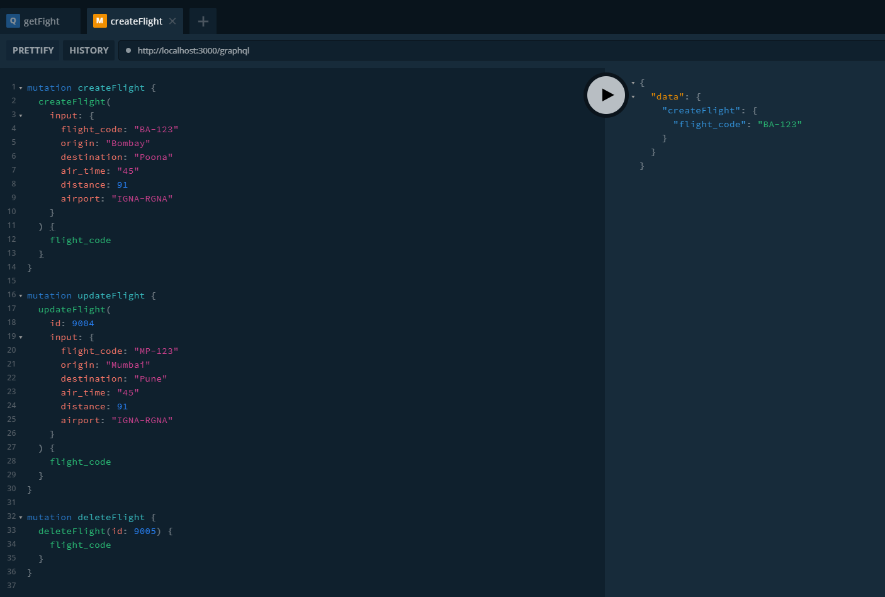

## Creating Nest JS GraphQL Api server
*Creating queries and mutations for basic CRUD operations*

> ### TypeScript(Node) + NestJS + GraphQL + TypeORM + MySQL

#

### Prerequisites

Make sure to have Node (TypeScript) and Nest JS installed globally before you begin.
You can install NestJS CLI by following command.

> npm i -g @nestjs/cli

---

#### * Browse to a new directory and open terminal in the VS Code (or editor of your choice).
Type following on the terminal prompt
> nest new nest-graphql-api

`You can change the project name if you wish.`

---

#### * Install the required packages

> npm install graphql @nestjs/graphql graphql-tools apollo-server-express mysql typeorm @nestjs/typeorm class-validator

`Replace YOUR_ACCOUNT_USERNAME and YOUR_ACCOUNT_PASSWORD with the actual username and password of your MySQL server instance.`

*You might need to grant the additional rights for the user to get connected via node and typeorm*

---
#### * Delete the App Controller and App Service files (Optional)

---
#### * Add GraphQL references in App Module in `imports` array
    
        GraphQLModule.forRoot({
            typePaths: ['./**/*.graphql'],
            playground: true,
        }),

---

#### * Add TypeORM references in App Module in `imports` array as well

      TypeOrmModule.forRoot({
        type: 'mysql',
        host: 'localhost',
        port: 3306,
        username: 'root',
        password: 'SqlAdmin$123',
        database: 'flight_db',
        entities: [
        "dist/**/*.entity.{ts,js}"
      ],
        synchronize: true,
      }),

---

#### * Create MySQL Database and Create Table Seed some sample Data

      CREATE DATABASE flight_db
      CHARACTER SET utf8mb4
      COLLATE utf8mb4_0900_ai_ci;

      SET NAMES 'utf8';
      USE flight_db;
      CREATE TABLE flight (
        id int(11) NOT NULL AUTO_INCREMENT,
        flight_code varchar(10) NOT NULL,
        origin varchar(10) NOT NULL,
        destination varchar(10) NOT NULL,
        air_time varchar(5) NOT NULL,
        airport varchar(50) NOT NULL,
        distance int(11) NOT NULL,
        PRIMARY KEY (id)
      )
      ENGINE = INNODB,
      AUTO_INCREMENT = 9005,
      AVG_ROW_LENGTH = 173,
      CHARACTER SET utf8mb4,
      COLLATE utf8mb4_0900_ai_ci;

---

#### * Seed some sample Data

      USE flight_db;
      INSERT INTO flight(id, flight_code, origin, destination, air_time, airport, distance) VALUES
      (1, '9E-3331', 'JFK', 'BOS', '41', 'General Edward Lawrence Logan Intl', 0),
      (2, '9E-3331', 'JFK', 'BOS', '46', 'General Edward Lawrence Logan Intl', 0),
      (3, '9E-3338', 'JFK', 'ORD', '146', 'Chicago Ohare Intl', 0),
      (4, '9E-3338', 'JFK', 'ORD', '150', 'Chicago Ohare Intl', 0),
      (5, '9E-3359', 'JFK', 'ORD', '141', 'Chicago Ohare Intl', 0),
      (6, '9E-3359', 'JFK', 'ORD', '143', 'Chicago Ohare Intl', 0),
      (7, '9E-3422', 'JFK', 'BOS', '43', 'General Edward Lawrence Logan Intl', 0),
      (8, '9E-3422', 'JFK', 'BOS', '38', 'General Edward Lawrence Logan Intl', 0),
      (9, '9E-3422', 'JFK', 'BOS', '34', 'General Edward Lawrence Logan Intl', 0),
      (10, '9E-3422', 'JFK', 'BOS', '37', 'General Edward Lawrence Logan Intl', 0);

---
#### *  Create TypeORM Entity (For this example Flight)

import { Entity, Column, PrimaryGeneratedColumn } from 'typeorm';

`flight.entity.ts` - Make sure your file name ends with `.entity.ts`

    @Entity('flight')
    export class FlightEntity {
      @PrimaryGeneratedColumn('increment')
      id: number;

      @Column({ length: 10 })
      flight_code: string;

      @Column({ length: 10 })
      origin: string;

      @Column({ length: 10 })
      destination: string;

      @Column({ length: 5 })
      air_time: string;

      @Column()
      distance: number;

      @Column({ length: 50 })
      airport: string;
    }

`Class needs to be marked with `@Entity `annotation (Pass the table name if the class name and table name are different).
Primary Key Column needs to be marked with `@PrimaryGeneratedColumn('increment')` annotation.`

---
#### *  Create GraphQL Schema (For this example Flight)

`flight.graphql` - Make sure your file name ends with `.graphql` as the Entry in App Module looks for the `typePaths: ['./**/*.graphql']`.

    type Flight {
      id: Int
      flight_code: String!
      origin: String!
      destination: String!
      air_time: String!
      distance: Int
      airport: String!
    }

    input FlightInput {
      flight_code: String!
      origin: String!
      destination: String!
      air_time: String!
      distance: Int
      airport: String!
    }

These are the type definitions and Input types simply needs to be denoted by `input` keyword

! symbol denotes not null field, however use them ONLY when the data field guaranties to return data all the time. `String!` is strict versus `String` (which means you can not have null data).

---
#### *  Append Queries and Mutations to GraphQL Schema

`flight.graphql` - Further add the following types

    type Query {
      flights: [Flight!]
      flight(id: Int): [Flight!]
    }

    type Mutation {
      createFlight(input: FlightInput!): Flight
      updateFlight(id: Int, input: FlightInput!): Flight
      deleteFlight(id: Int): Flight
    }

Queries and Mutations are also considered as special types in GraphQL and needs to be defined in within the schema. The above example specifies the `SELECT` OR `READ` operations via `queries` while `CREATE`, `UPDATE` and `DELETE` operations are defined as mutations.

Note the return types are specified as the Type defined in the schema above and Returned as either Single object (`Flight`) or an Array (`[Flight!]`).

---
#### *  Create additional Input types

    export class FlightInput {
      flight_code: string;
      origin: string;
      destination: string;
      air_time: string;
      distance: number;
      airport: string;
    }

---
#### *  Create Resolver class and implement the schema

`flight.resolver.ts`

*For clarity the example has been shortened, see the source for complete implementation.*

    import { Resolver, Query, Mutation, Args } from '@nestjs/graphql';
    import { FlightEntity } from './flight.entity';
    import { FlightService } from './flight.service';
    import { FlightInput } from './flight.input';

    @Resolver(of => FlightEntity)
    export class FlightResolver {
      constructor(private readonly flightService: FlightService) {}

      @Query(() => [FlightEntity])
      async flights() {
        return this.flightService.getFlights();
      }
        ...
      @Mutation(() => FlightEntity)
      async deleteFlight(@Args('id') id:number) {
        return await this.flightService.deleteFlight(id);
      }
    }

`Class needs to have @Resolver annotation and Every operation must have either @Query or @Mutation annotation depending upon its definition as per the schema.`

`Note that service is being injected via constructor`

---
#### *  Create Service class and implement corresponding operations

`flight.service.ts`

*For clarity the example has been shortened, see the source for complete implementation.*

    import { Injectable, Inject } from '@nestjs/common';
    import { InjectRepository } from '@nestjs/typeorm';
    import { Repository } from 'typeorm';
    import { FlightEntity } from './flight.entity';
    import { FlightInput } from './flight.input';
    import e from 'express';

    @Injectable()
    export class FlightService {
      constructor(
        @InjectRepository(FlightEntity)
        private flightsRepository: Repository<FlightEntity>,
      ) {}

      async getFlights(): Promise<FlightEntity[]> {
        return await this.flightsRepository.find({});
      }

      ...

      async deleteFlight(id: number) {
        const existingFlight = await this.flightsRepository.findOne(id);
        if (existingFlight) {
          let result = this.flightsRepository.delete(existingFlight);
          return existingFlight;
        }
        else{
          return null;
        }
      }
    }

---

#### *  Assemble everything within the module 

`flights.module.ts`

    import { Module } from '@nestjs/common';
    import { TypeOrmModule } from '@nestjs/typeorm';
    import { FlightService } from './flight.service';
    import { FlightEntity } from './flight.entity';
    import { FlightResolver } from './flight.resolver';

    @Module({
      imports: [TypeOrmModule.forFeature([FlightEntity])],
      providers: [FlightService, FlightResolver],
    })
    export class FlightsModule {}

  `Check how the Resolver and Service classes have been referenced and the TypeORM has been supplied with the entity references.`

#### *  Update the App Module 

Import the module in app.module.ts in the `imports: []` after the TypeORM and GraphQL references. All such modules needs to be referenced in the App module to initiate the corresponding resolvers and services by NestJS.

#### *  Running the server and checking the GraphQL API

type and execute the following command on the terminal

> npm run start

OR (if need hot loading)

> npm run start:dev

Executing Queries should look like 

Executing Mutations should look like 

